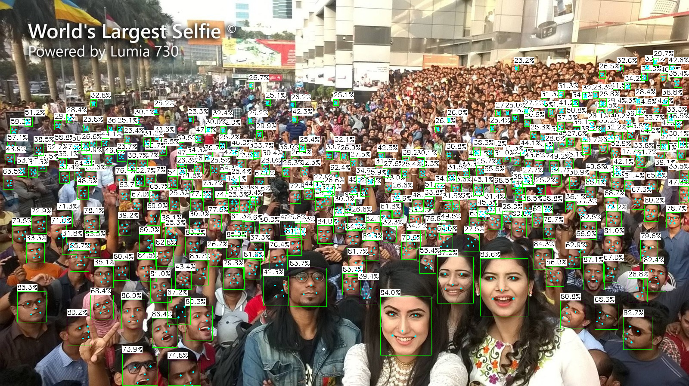
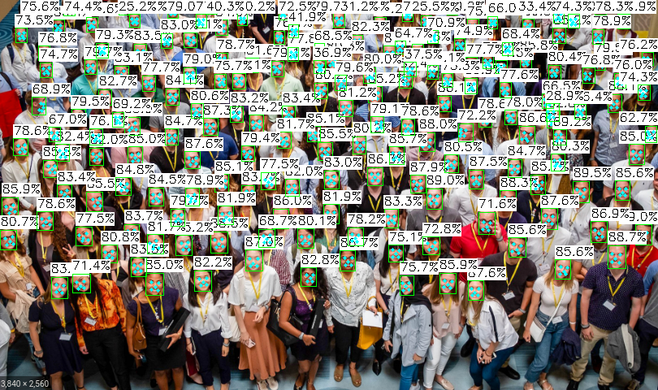
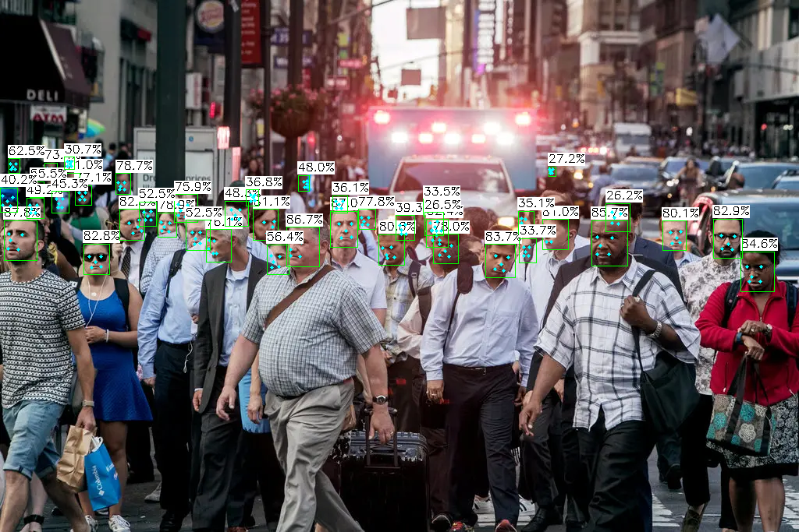

# SCRFD face detection TensorRT
This is an implementation of the [SCRFD](https://arxiv.org/pdf/2105.04714.pdf) face detection with NVIDIA TensorRT C++ API.

This repo is based on the [InsightFace](https://github.com/deepinsight/insightface) and [TensorRTX](https://github.com/wang-xinyu/tensorrtx).

# Export scrfd onnx
1. Clone the repository from https://github.com/deepinsight/insightface
2. In file <em>detection/scrfd/mmdet/models/dense_heads/scrfd_head.py</em>, replace these lines
```
batch_size = cls_score.shape[0]
cls_score = cls_score.permute(0, 2, 3, 1).reshape(batch_size, -1, self.cls_out_channels).sigmoid()
bbox_pred = bbox_pred.permute(0, 2, 3, 1).reshape(batch_size, -1, 4)
kps_pred = kps_pred.permute(0, 2, 3, 1).reshape(batch_size, -1, 10)
```
by 
```
cls_score = cls_score.sigmoid()
```
2. Download ckpt of desired models from https://github.com/deepemight/emightface/blob/master/detection/scrfd/README.md
3. Generate onnx file using <em>scrfd2onnx.py</em>, for example
```
python detection/scrfd/tools/scrfd2onnx.py detection/scrfd/configs/scrfd/scrfd_2.5g_bnkps.py <path_to_ckpt>
```
After this step, check the generated onnx file <em>scrfd_2.5g_bnkps_shape640x640.onnx</em> in <em>detection/scrfd/onnx/</em>
# Create the trt engine and run inference
1. Clone the scrfd_tensorRT repository
2. Copy <em>scrfd_2.5g_bnkps_shape640x640.onnx</em> into <em>models</em> folder
3. Generate the engine
```
trtexec --onnx=scrfd_2.5g_bnkps_shape640x640.onnx \
        --saveEngine=scrfd_2.5g_bnkps_shape640x640.trt 
```
4. Verify the generated engine
```
polygraphy empect model scrfd_2.5g_bnkps_shape640x640.trt --model-type=engine
```
Check whether the input and output names and shapes are correct
```
Binding Index: 0 (Input)  [Name: input.1]  | Shapes: min=(1, 3, 640, 640), opt=(1, 3, 640, 640), max=(1, 3, 640, 640)
Binding Index: 1 (Output) [Name: bbox_8]   | Shape: (1, 8, 80, 80)
Binding Index: 2 (Output) [Name: kps_8]    | Shape: (1, 20, 80, 80)
Binding Index: 3 (Output) [Name: score_8]  | Shape: (1, 2, 80, 80)
Binding Index: 4 (Output) [Name: bbox_16]  | Shape: (1, 8, 40, 40)
Binding Index: 5 (Output) [Name: kps_16]   | Shape: (1, 20, 40, 40)
Binding Index: 6 (Output) [Name: score_16] | Shape: (1, 2, 40, 40)
Binding Index: 7 (Output) [Name: bbox_32]  | Shape: (1, 8, 20, 20)
Binding Index: 8 (Output) [Name: kps_32]   | Shape: (1, 20, 20, 20)
Binding Index: 9 (Output) [Name: score_32] | Shape: (1, 2, 20, 20)
```
5. Build 
```
mkdir build
cd build
cmake ..
make -j4
```
6. Run inference by specify the engine and input image, for example
```
./build/scrfd models/scrfd_2.5g_bnkps_shape640x640.trt test_images/worlds-largest-selfie.jpg 
```
# Results
Sample output images from <em>scrfd_2.5g_bnkps</em> model



# Fps measurement
Inference multiple times for measuring the fps, for example
```
./build/scrfd models/scrfd_2.5g_bnkps_shape640x640.trt test_images/worlds-largest-selfie.jpg 10000
```
<!-- Results on some Jetson devices:
| Model | Jetson Nano  | Jetson Xavier NX  |
| :---:   | :-: | :-: |
| scrfd_500m_bnkps | | 51.45 ~ 68.75 |
| scrfd_2.5g_bnkps | | 48.92 ~ 64.58 |
| scrfd_10g_bnkps | | 26.11 | -->

# References
- [Sample and Computation Redistribution for Efficient Face Detection](https://arxiv.org/pdf/2105.04714.pdf)
- [InsightFace](https://github.com/deepinsight/insightface)
- [TensorRTX](https://github.com/wang-xinyu/tensorrtx)